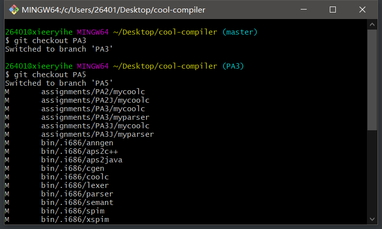
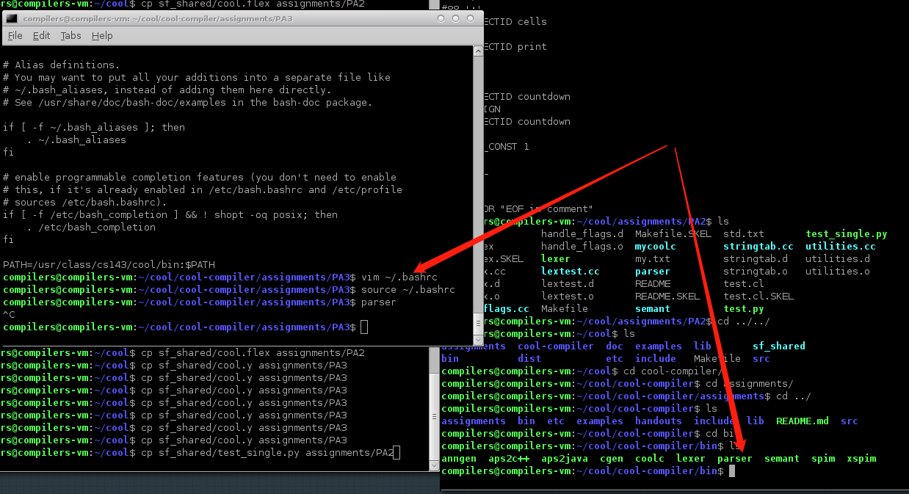
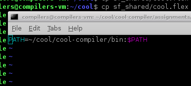
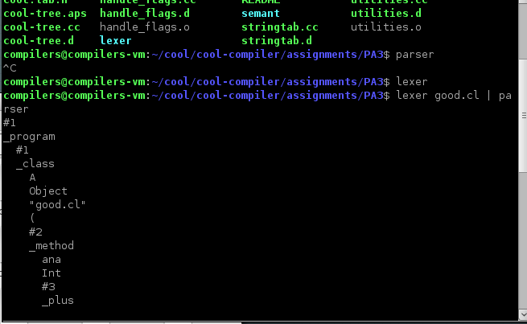
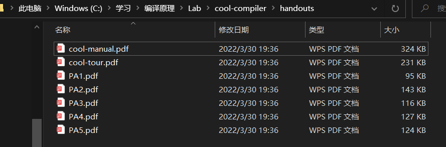
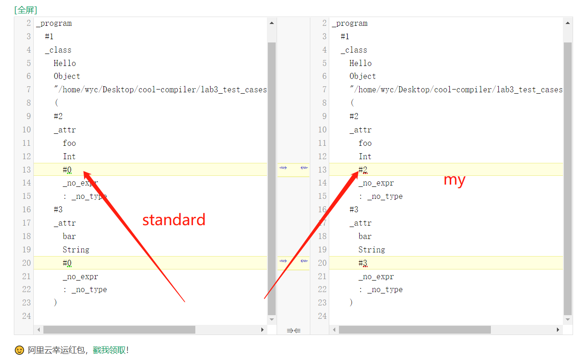
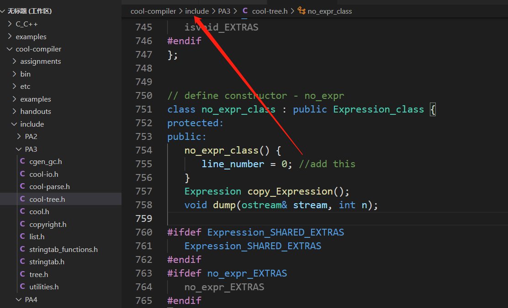
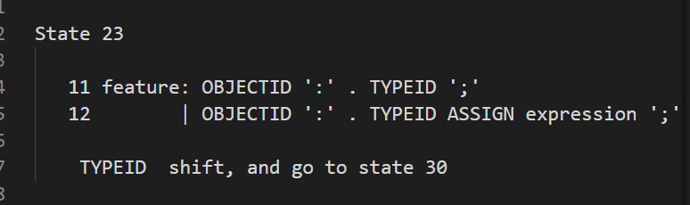
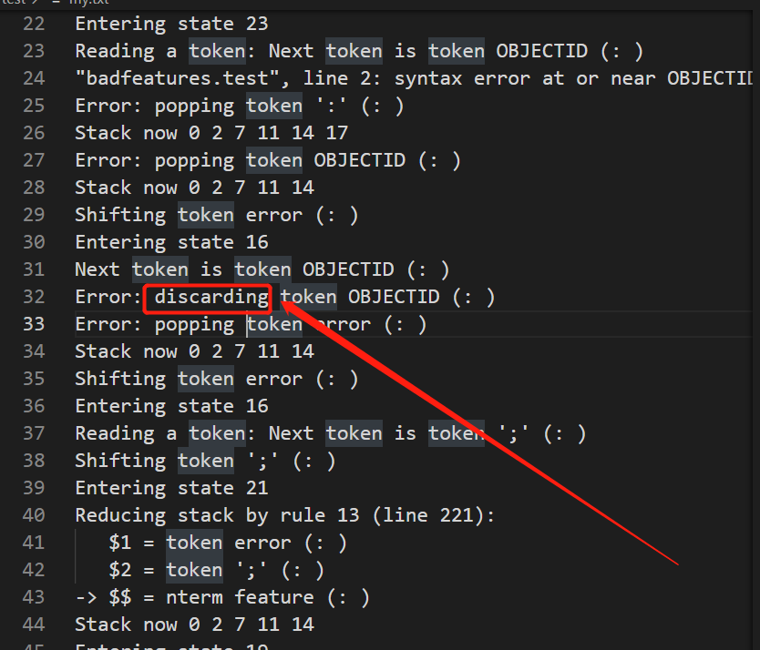
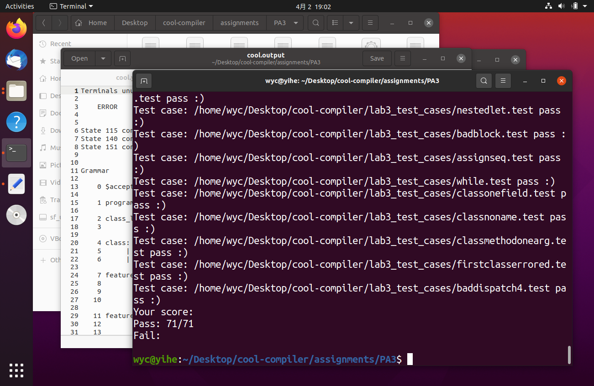

## 环境配置

直接在人家给的虚拟机上运行会有各种各样的问题，包括编译出错。

助教给出了解答：

去官网上下载源码

http://10.176.36.25:10143/cool-src.tar.gz

进去之后发现只有PA1，在有git的目录下，可以先放到windows里面，



把PA1~PA5全部pull下来。再移到虚拟机里做。




修改 ~./bashrc 将最后一行的PATH路径改为该lab的assignment同级目录的bin目录的路径



因为这个bin里面是标准的解析器等，相当于加了环境变量。

后面的source ~/.bashrc 是为了让之前的 .bashrc 文件生效。然后就可以了




自己的环境下也是这样。

如果自己的环境下报错什么，直接百度，大部分是因为缺少相关组件。apt install就行。


## 做法

注意：每次生成新的parser，都要执行`make parser`才行。

### 1.参考资料

本次lab3主要看两个文档

《A Tour of the Cool Support Code》（后简称tour）和《The Cool Reference Manual》（后简称manual），百度就行。

也可以在自带的handouts文件夹里，两个文档。



其余资料

[从头学习compiler系列2——COOL语言学习1 - Pinkman - 博客园 (cnblogs.com)](https://www.cnblogs.com/pinkman/archive/2013/03/12/2954902.html)

[YACC (silcnitc.github.io)](https://silcnitc.github.io/yacc.html)

[聊聊编译原理（二） - 语法分析 - 御坂研究所 (nosuchfield.com)](https://www.nosuchfield.com/2017/07/30/Talk-about-compilation-principles-2/)

关于AST和自下而上推导，上下文无关文法，可以自己搜索。

### 2.lab目标

本次lab是要模仿`cool.y`中关于 program，class_list 和 class 的写法，写出其余的部分。比如一个program为AST的根，它可以由一个class_list开始，即一个.cl程序开始肯定先定义一大堆类定义，当然，对于cool语言，只能是一大堆类定义开始。所以在规则部分（用%%分隔开的三部分，第二部分就是规则部分），最开始就是：

```y
    /* 
    Save the root of the abstract syntax tree in a global variable.
    */
    program	: class_list	{ @$ = @1; ast_root = program($1); }
    ;
```

关于$ 和 @ 符号，可以去看从头学习compiler系列，简单讲两个符号后的数字都表示右边生成式的第几个元素。@1就是冒号右边的第一个元素class_list，\$\$表示生成式左边的元素（因为是CFG，所以左边肯定只有一个非终结符）。关于bison的文章。本次lab的语法分析也是关于bison工具的。

[从头学习compiler系列5——bison实践 - Pinkman - 博客园 (cnblogs.com)](https://www.cnblogs.com/pinkman/p/3179056.html)

关于class部分

```y
    class_list
    : class			/* single class */
    { $$ = single_Classes($1);
    parse_results = $$; }
    | class_list class	/* several classes */
    { $$ = append_Classes($1,single_Classes($2)); 
    parse_results = $$; }
    ;
    
    /* If no parent is specified, the class inherits from the Object class. */
    class	: CLASS TYPEID '{' dummy_feature_list '}' ';'
    { $$ = class_($2,idtable.add_string("Object"),$4,
    stringtable.add_string(curr_filename)); }
    | CLASS TYPEID INHERITS TYPEID '{' dummy_feature_list '}' ';'
    { $$ = class_($2,$4,$6,stringtable.add_string(curr_filename)); }
    ;
```

上述代码包含 `single_Classes`，`append_Classes`等函数，在tour里面有说明，AST Sequences部分。上述有一行

` { $$ = class_($2,idtable.add_string("Object"),$4,`

意思是所有类都是继承的，如果没有显式继承别的类，那就继承Object类，所以在语法分析里，手动添加了字符串"Object"。

---

CLASS TYPEID这种就是之前词法分析做的内容。


关于如何构建AST，都有哪些元素。可以看lab3文件夹下`cool-tree.aps`文件，里面几乎给出了所有参考。结合tour那篇文章，并模仿给出的class代码即可。


## BUG

### 1.冲突

常见的错误是：

```y
	feature_list :		/* empty */
    { $$ = nil_Features(); }
    | feature   /* single feature */
    { $$ = single_Features($1);
    parse_results = $$; }
    | feature_list feature  /* several features */
    { $$ = append_Features($1,single_Features($2));
    parse_results = $$; }
    ;
```

可以看到，feature_list是可为空的，那如果只有一个feature的list，是选择先生成feature_list feature，再将第一个list为空，还是直接选择生成feature呢？这就造成了二义性。之前class写

```y
class_list
    : class			/* single class */
    { $$ = single_Classes($1);
    parse_results = $$; }
```

是因为class_list是不可为空的，所以必须至少有一个，现在feature_list可为空，直接写

```y
    feature_list :		/* empty */
    { $$ = nil_Features(); }
    | feature_list feature  /* several features */
    { $$ = append_Features($1,single_Features($2)); }
    ;
```

即可。

当然，formal_list形参列表也有类似的问题，不过一个形参不需要逗号，多个形参需要逗号，所以写成

```y
    formal_list:
    { $$ = nil_Formals(); } /* $$ = no_expr(); */
    | formal
    { $$ = single_Formals($1); }
    | formal_list ',' formal
    { $$ = append_Formals($1, single_Formals($3)); }
    ;
```

即可。


### 2.关于可为空

诸如`Xs`，即List类型的，可以用`nil_Features();`这种获取可为空的list，但是如果是feature这种独特类型，用`{ $$ = attr($1,$3,no_expr() ); }`，即no_expr()，返回可为空的内容。

```y
  phylum Class_;
  phylum Classes = LIST[Class_];

  phylum Feature;
  phylum Features = LIST[Feature];

  phylum Formal;
  phylum Formals = LIST[Formal];

  phylum Expression;
  phylum Expressions = LIST[Expression];

  phylum Case;
  phylum Cases = LIST[Case];
```


### 3.关于类型转换

```y
    | OBJECTID '(' expression_list ')' ';'
    { $$ = dispatch(object(idtable.add_string("self")), $1, $3); }
```

本来照抄class的代码是这样的

```y
    | OBJECTID '(' expression_list ')' ';'
    { $$ = dispatch(idtable.add_string("self"), $1, $3); }
```

但是add_string返回的是Elem * 类型（在assignment同级目录include对应的PA3文件夹下的stringtab.h中定义。

```h
   // add the (null terminated) string s
   Elem *add_string(char *s);
```

cool_tree.asp中最后一行有定义

```y
constructor object(name: Symbol): Expression;
```

用这个转换成Expression类型即可。

### 4.关于行号

测试案例中，除了行号之外，其余都正确。



因为标准的parser在no_expr_class的构造函数里有一行，如下添加即可。



注意，是include里面的PA3的 cool-tree.h 。注意，一定要make clean


### 5.关于调试

每次编译parser（make parser）之后，会生成一个 `cool.output`文件，这个是状态转换表和所有的规则文件，很长（2k行+的样子）。单独执行文件可以加 `-p` 参数，显示归约过程。如 `./lexer badfeatures.test | ./parser -p` ，从而对照`cool.output`转换表，了解整个bison的解析过程是怎么样的。

本质上解析是一个LALR(1)文法，（注意，其中的 .  符号是当前自动机所处的位置）



如上如，在State23时，当前在 ':' 之后，下一个期望的字符为 TYPEID。如果下一个不是TYPEID，比如遇到了OBJECTID，那么就会pop掉该语句的内容，比如本例子就会pop掉 ':' 和 OBJECTID ，并移进一个error标志，然后继续往后读。注意，之前只是扫描预读到了OBJECTID，并没有移进，所以此时栈顶是一个error，再预读一下个标志，还是那个OBJECTID，此时没有写对应的错误处理，所以就会显示 discarding token



此时语句只有一个error，所以就只pop掉这一个error，然后忽略掉OBJECTID，继续预读下一个字符，发现是 ';'，之前有写规则如下

```y
    feature : 
      OBJECTID '(' formal_list ')' ':' TYPEID '{' expression '}' ';'
    { $$ = method($1,$3,$6,$8); }
    | OBJECTID ':' TYPEID ';'
    { $$ = attr($1,$3,no_expr() ); }
    | OBJECTID ':' TYPEID ASSIGN expression ';'
    { $$ = attr($1,$3,$5);}
    | error ';' {}
```

其中有 `error ';'`，所以就按照该规则归约，并继续读，否则继续归约error。从刚才那张图也可以看到

```y
Reducing stack by rule 13 (line 221):
   $1 = token error (: )
   $2 = token ';' (: )
-> $$ = nterm feature (: )
```

该规则只有两个字符，error 和 ';' 归约成非终结符 feature。

弄明白了error的归约过程，写归约条件就很容易了。

比如对于如下`badfeatures.test`

```y
class A {
  x : int;
  f(x : Int) : Int {
    5;
  };
  y : Bool
};
```

我想检查出第二行的问题之后（int小写开头是OBJECTID，不是TYPEID），继续向后执行，怎么做呢？

主要规则如下

    class	: CLASS TYPEID '{' feature_list '}' ';'
    { $$ = class_($2,idtable.add_string("Object"),$4,
    stringtable.add_string(curr_filename)); }
    | CLASS TYPEID INHERITS TYPEID '{' feature_list '}' ';'
    { $$ = class_($2,$4,$6,stringtable.add_string(curr_filename)); }
    | error ';' { }
    ;
    
    feature_list :		/* empty */
    { $$ = nil_Features(); }
    | feature_list feature   /* several features */
    { $$ = append_Features($1,single_Features($2)); }
    ;
    
    feature : error ';' {} ;

对于class，扫描到 '{' 肯定会进入feature_list，进入feature_list后，发现可为空，首先会调用可为空的归约，然后进入右半部分feature_list feature，此时又扫描到标识符x，也即OBJECTID，于是判定，进入了feature的归约。

继续，正常扫描到 ':' ，继续，扫描到一个OBJECTID，但是在刚才已经看到的状态表中，此时只期望一个TYPEID，于是在feature中，发生错误，像之前分析的一样，pop掉 ':' 和 OBJECTID (x)，discard掉 OBJECTID(int)，预扫描到 ';' 发现可行，有规则 `error ';'`，于是归约成 feature，继续执行。

OK



本来就70个案例，多的一个是不小心自己复制的一个文本文件，不影响测试。
