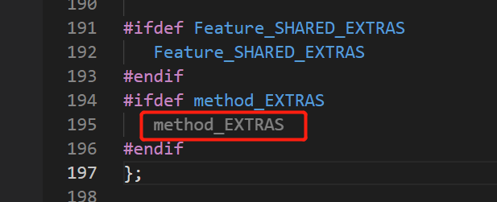

助教讲解的视频资料

[编译 Lab4 - 语义分析介绍_哔哩哔哩_bilibili](https://www.bilibili.com/video/BV1U44y1P7XH?p=2)


## 杂项

本次lab需要写的文件是`semant.cc`文件，采用c++语法。当然也包括`semant.h`的修改以及`cool-tree.handcode.h`的修改。需要写的就是这三个文件，但是还有其它很多文件需要看，尤其是`cool-tree.h`。


`semant-phase.cc`解释了整个解析的接口入口，代码只有十几行，关键代码如下

```c++
int main(int argc, char *argv[]) {
  handle_flags(argc,argv);
  ast_yyparse();
  ast_root->semant();						//先检查
  ast_root->dump_with_types(cout,0);		//再打印输出分析的结果
}
```


`dumptype.cc`给出了一些具体函数，展示了打印工作的细节，比如如下`dumptype.cc`代码片段，在149行。

```c++
void class__class::dump_with_types(ostream& stream, int n)
{
   dump_line(stream,n,this);
   stream << pad(n) << "_class\n";
   dump_Symbol(stream, n+2, name);
   dump_Symbol(stream, n+2, parent);
   stream << pad(n+2) << "\"";
   print_escaped_string(stream, filename->get_string());
   stream << "\"\n" << pad(n+2) << "(\n";
   for(int i = features->first(); features->more(i); i = features->next(i))
     features->nth(i)->dump_with_types(stream, n+2);
   stream << pad(n+2) << ")\n";
}
```


接口需要在`cool-tree.handcode.h`中定义，都是一些宏，转到定义看一下就知道了。


重点还在cool-tree.h部分，关于class_的类定义如下

```c++
// define constructor - class_
class class__class : public Class__class {
protected:
   Symbol name;
   Symbol parent;
   Features features;
   Symbol filename;
public:
   class__class(Symbol a1, Symbol a2, Features a3, Symbol a4) {
      name = a1;
      parent = a2;
      features = a3;
      filename = a4;
   }
   Class_ copy_Class_();
   void dump(ostream& stream, int n);

#ifdef Class__SHARED_EXTRAS
   Class__SHARED_EXTRAS
#endif
#ifdef class__EXTRAS
   class__EXTRAS
#endif
};
```

其中最主要的是protected权限中的属性，还有一些函数等等，标识了我们写代码时可以利用的属性。


## 起步

### 1.初始化ClassTable

ClassTable类是一个官方提供的类，也即容器，可以利用它来实现一系列检查，即在类中增添方法。也可以自己写一个类。这里采用人家给的模板。

install_basic_classes()函数只是一个不完全的代码，其中创建了五种基本的类的class，但是这只是局部变量，你需要将其添加到自己定义的列表中，人家给的ClassTable构造函数就是让你用基本的Classes，来实现自己的列表，当然也可以用人家的。这里采用的人家的，所以构造函数很简单，只是单纯地将人家的classes利用append函数连接。

```c++
ClassTable::ClassTable(Classes classes) : semant_errors(0) , error_stream(cerr) {
    /* Fill this in */
    classlist = classlist->append(classlist,classes);
    install_basic_classes();
}
```

当然也可以用=赋值指针，Classes本质上就是指针。

这个classlist是自己给ClassTable添加的一个属性，在`semant.cc`中加入即可。

```c++
...
public:
  Classes classlist; //my list
...
```

这样，一个类列表就初始化好了。


### 2.关于虚函数

可以在`cool-tree.handcode.h`中看到类似如下代码

```c++
#define branch_EXTRAS                                   \
void dump_with_types(ostream& ,int);


#define Expression_EXTRAS                    \
Symbol type;                                 \
Symbol get_type() { return type; }           \
Expression set_type(Symbol s) { type = s; return this; } \
virtual void dump_with_types(ostream&,int) = 0;  \
void dump_type(ostream&, int);               \
Expression_class() { type = (Symbol) NULL; }

#define Expression_SHARED_EXTRAS           \
void dump_with_types(ostream&,int); 
```

`Expression_EXTRAS`这种不带shared的，意思是Expression的父类，其衍生了许多子类，每个子类有不同的属性等等。此时，如果子类共有的函数，可以实现在父类中，也即EXTRAS的部分，但是又子类特有的，执行的时候又不能调用父类的函数，所以就有了SHARED_EXTRAS，这个宏。子类特有的函数，实现在这里。但是声明写在EXTRAS（父类）中，声明成纯虚函数。这样就可以解决子类不同的调用父类函数问题了。

当然，一般都是纯虚函数声明在大写的里面，实现写在小写的里面。

比如Feature_class最终衍生出方法和属性两个子类

```c++
class method_class : public Feature_class {
protected:
   Symbol name;
   Formals formals;
   Symbol return_type;
   Expression expr;
public:
   method_class(Symbol a1, Formals a2, Symbol a3, Expression a4) {
      name = a1;
      formals = a2;
      return_type = a3;
      expr = a4;
   }
   Feature copy_Feature();
   void dump(ostream& stream, int n);

#ifdef Feature_SHARED_EXTRAS
   Feature_SHARED_EXTRAS
#endif
#ifdef method_EXTRAS
   method_EXTRAS
#endif
};

// define constructor - attr
class attr_class : public Feature_class {
protected:
   Symbol name;
   Symbol type_decl;
   Expression init;
public:
   attr_class(Symbol a1, Symbol a2, Expression a3) {
      name = a1;
      type_decl = a2;
      init = a3;
   }
   Feature copy_Feature();
   void dump(ostream& stream, int n);

#ifdef Feature_SHARED_EXTRAS
   Feature_SHARED_EXTRAS
#endif
#ifdef attr_EXTRAS
   attr_EXTRAS
#endif
};
```

可以看到name是共有的属性，那么name的纯虚函数写到Feature_EXTRAS中，实现写在Feature_SHARED_EXTRAS

```c++
#define Feature_EXTRAS                              \
virtual Symbol get_name() = 0;					   \
virtual void dump_with_types(ostream&,int) = 0; 	

#define Feature_SHARED_EXTRAS                      \
Symbol get_name() { return name; }					   \
void dump_with_types(ostream&,int);    


#define Formal_EXTRAS                              \
virtual void dump_with_types(ostream&,int) = 0;

#define formal_EXTRAS                              \
void dump_with_types(ostream&,int);
```

但是Formals是成员函数特有的，要将纯虚函数写在method_EXTRAS大写的中，实现写在小写的中。即可。`cool-tree.handcode`甚至没给出method_EXTRAS，都是灰色的。



注意，此时method，已经不可能再有类继承它了，所以一开始就是小写的，没有大写版本，直接实现写在小写的宏中即可。


一个大表达式的最终类型是什么，看cool-manual，或者网上的翻译版[从头学习compiler系列2——COOL语言学习1 - Pinkman - 博客园 (cnblogs.com)](https://www.cnblogs.com/pinkman/archive/2013/03/12/2954902.html)

具体怎么写，原因等都在代码注释里。
